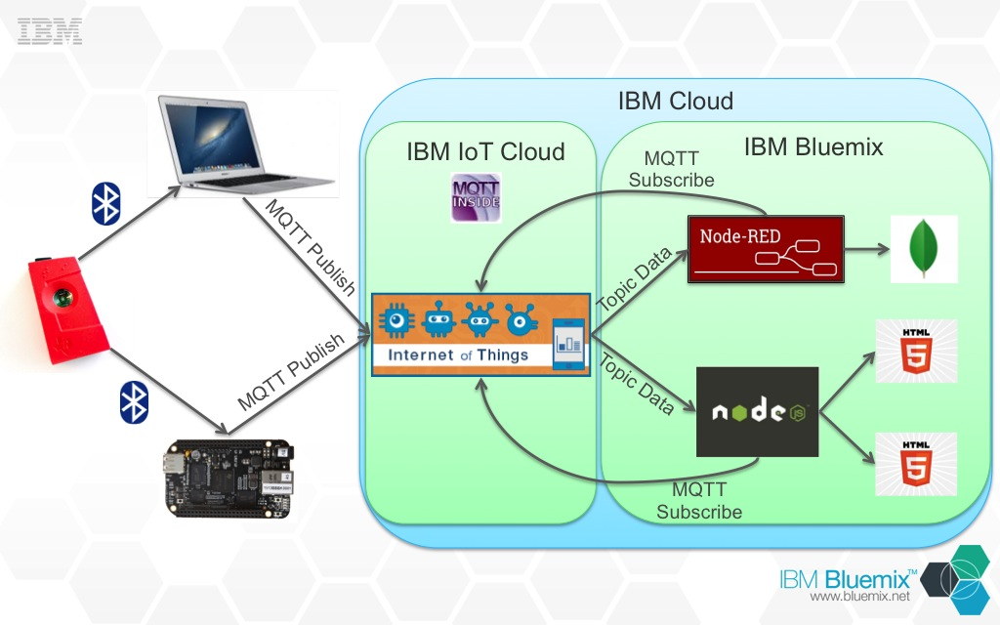

## About 
This repo contains the code needed to connect to [IBM's IoT Cloud](https://internetofthings.ibmcloud.com/#/) 
and publish and retrieve data from a [Texas Instruments Sensor Tag](http://www.ti.com/tool/cc2541dk-sensor).

For a demonstration of the applications within this repo you can watch the following 2 videos

### Short Version

### Long Version

The [publish directory](https://github.com/IBM-Bluemix/iot-sensor-tag/tree/master/publish) contains a Node.js application 
that can be placed on any device connected to the internet and is capable of using Bluetooth low-energy 
(LE) to connect to the Sensor Tag.  This application publishes sensor data from the Sensor Tag to the IBM IoT Cloud.

The [subscribe directory](https://github.com/IBM-Bluemix/iot-sensor-tag/tree/master/subscribe) contains a 
Node.js application which connects to the IBM IoT Cloud and uses the Sensor Tag data in various ways.  

* An application to control an HTML5 presentation deck with the
Sensor Tag buttons.  
* An application which visualizes the temperature, accelerometer, gyroscope, and magnetometer
data from the Sesnor Tag.

The [node-red directory](https://github.com/IBM-Bluemix/iot-sensor-tag/tree/master/node-red) contains an exported flow 
which you can import into your Node-RED instance of Bluemix to see the data being published from the Sensor Tag.

Here is a diagram that describes how the apps work with the IBM IoT Cloud and Bluemix.

## License
This code is licensed under Apache v2.  See the LICENSE file in the root of
the repository.